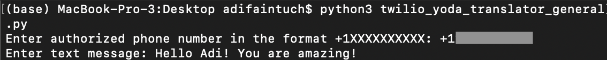
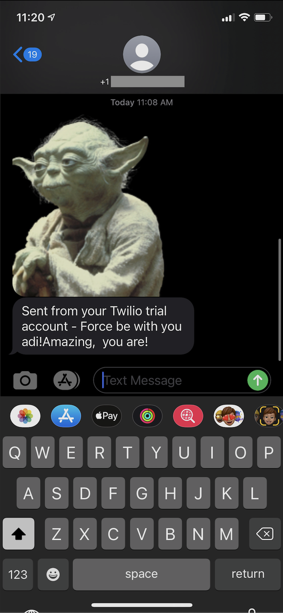

# yoda_translator_twilio
An upgraded version of my original Yoda Translator app using Twilio's API

## This code prompts you to enter a phone number (must be registered in your Twilio account) and a message and it automatically translates it into 'Yoda Speak' via a yoda translation web API and sends it and a picture of Yoda to the phone number of your choice

## How to use:
### 1. Move into the folder where yoda_translator_twilio_general.py is located inside terminal
### 2. Run the command 'python3 yoda_translator_twilio_general.py' in terminal
#### You will need to manually enter your own Twilio Phone Number, your Twilio account_sid and your Twilio auth_token in the code in order to be able to use it (there are comments indicating where to enter these details in the code)

### The yoda translation web API allows for only 5 requests per hour, so if you exceed the limit you will get a message like this:

